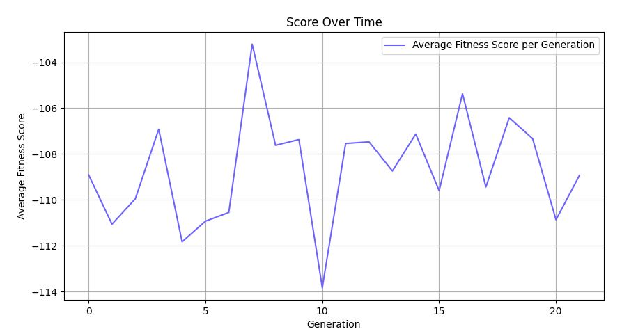

# Generic Genetic Algorithm for Gymnasium Environments

## Project Overview
This project applies a simple genetic algorithm to optimize solutions in various Gymnasium game environments. 
The genetic algorithm iteratively adjusts neural networks to enhance performance in games.

The genetic algorithm showcased notable limitations in efficiency, primarily due to constraints within the gym environment preventing parallel execution of the population's runs from scratch, its utility remained significant as it presents an intriguing way for exploring the Machine Learning.
Its utilization underscores the vast potential for enhancing and optimizing algorithms, facilitating faster capitalization on the discovery of novel features.

The genetic algorithm is not the most effecience one as the gym environment doesn't allow us from scratch to parrallelise the running of the population.
It can be slow but it's an interresting way to explore Machine Learning, and show us that there is a huge room for improvement and optimisation of the algorithm to capitalize faster on the discovery of new features

Tested on CartPole-v1, MountainCar-v0, and LunarLander-v2, but adaptable to most games with discrete actions and simple observation spaces.
For games with continuous actions and/or different observation structures, adjustments are required in both the variable definitions and the neural network function activations.
https://gymnasium.farama.org/

<div>
  
  
     
</div>

## Fields of Improvement
Significant enhancements can be made to the genetic algorithm:

- Crossover Algorithm: Integrate a more advanced crossover method that considers the fitness scores of parents. This approach should aim to selectively propagate superior traits.
- Mutation Algorithm: Implement a more nuanced mutation strategy. Adjust mutation rates dynamically to balance exploration in the initial phases and refinement in later phases.
- Hyperparameter Adjustment: Develop a method to dynamically adjust hyperparameters as the generations progress. Currently, the mutation rate is modified by a static factor; exploring adaptive adjustments could lead to improved convergence and performance of the algorithm.
- Neural Network: Reflection and testing need to be conducted on the neural network to optimize the architecture and the activation function used for these environments.

## Repository Contents
- `classes/`: Module containing classes for neural network, environment runner, and genetic algorithms.
- `models/`: Saved pre-trained models for different environments.
- Main scripts for running simulations and visualizing results.

## Setup and Installation
1. **Clone the repository:**
   ```bash
   git clone https://github.com/maaaakks/genetic-algorithm-gym
   cd genetic-algorithm-gym
   
2. **Install dependencies:** 
    ```bash
    pip install torch gymnasium

3. **Run the simulation:** 
    Execute the simulation for a specific environment by providing its identifier as a argument.
    By default 'CartPole-v1'.
    Pre-trained models are available in the "models" folder and can be deleted to initiate training from scratch.
    ```bash
    python main.py <environment_id>
    
### Environment Setup
1. **Initialization:**
   - The environment (e.g., CartPole-v1) is initialized with specific settings, such as :
        - rendering mode,
        - population size,
        - number of generations
        - hyperparameters like :
            - mutation rate,
            - minimun mutation rate
            - selection rate.
    - Adjust these settings to suit your needs. Currently, the mutation rate is set to 0 to exploit the model after training.
    - The mutation rate is reduced by a factor of 0.99 after each generation to facilitate model convergence but can't go lower than the minimun mutation rate.

### Neural Network Configuration
1. **Architecture Selection:**
   - The neural network is constructed using PyTorch.
   - The neural network's architecture is chosen depending on the complexity required by the environment.
   - The number of neurons in the input and output layers dynamically adjusts based on the environment's observations (input) and possible actions (output).
   - For less complex games, a basic neural network is used `<input - 16 - 16 - output>`, while more complex environments use an advanced architecture with additional hidden layers `< input - 64 - 64 - 64 - output>`.
   - However, this setup can be significantly enhanced, as it's currently arbitrary, based on empirical experience rather than systematic optimization.
   
2. **Activation functions:**
- Through extensive testing of various activation functions, it was discovered that exclusively utilizing the ReLU function (f(x) = max(0, x)) for the hidden layers consistently outperformed other architectures.

- Findings:
   - ReLU Dominance:
       The ReLU activation function demonstrated superior performance across multiple experiments.
       Its simplicity and effectiveness make it a standout choice for hidden layer activation.
   - Alternative Approach Evaluation:
       An alternative architecture was explored, incorporating a sigmoid function for the first layer.
       The objective was to retain information from negative values, albeit this approach proved slower and less successful in achieving superior performance.
   - Performance Comparison:
       Despite extended training over multiple generations, the sigmoid-based architecture failed to surpass the performance of the ReLU-based model.

- This strategy is still undergoing testing.

- Alternative - Tanh for Output Layer: Consider using tanh instead of the linear function when the actions in a continuous space need to be bounded within [-1, 1].

### Genetic Algorithm
1. **Population Initialization:**
   - A population of neural networks (individuals) is generated.
   - Each individual in the population is evaluated in the environment to determine its score (the total reward obtained during the environment simulation).
   - The reward is based on the Gym Environment, without any addition or removal.

2. **Evolution Process:**
   - **Selection:** Individuals are selected based on their scores. The fittest individuals have a higher chance of being chosen as parents for the next generation. (see hyperparameter selection rate)
   - **Crossover:** A crossover operation is performed between two parent neural networks to create a new individual. This involves averaging the weights of the parents to combine their features.
   - **Mutation:** To introduce variability, mutations are randomly applied to the neural network weights, which can alter their actions and strategies in the environment (see hyperparameter mutation rate).

3. **Simulation Execution:**
   - The simulation runs through the specified number of generations, with each generation evolve (selection, crossover, and mutation steps).
   
4. **Saving and Loading Populations:**
   - **Saving:** Allows the saving of the current population's state after each generation into a PyTorch file, named after the environment (e.g., `<environment_id>.pth`). This ensures that progress is not lost and can be reviewed or continued later.
   - **Loading:** Retrieves the saved model from the models directory, enabling the continuation or analysis of previously trained populations. If no saved model is found, a new population is initialized from scratch.

   
### Visualization and Analysis
- Fitness scores are collected and analyzed to track progress over generations in the runs folder.
- To visualize the progress using TensorBoard, execute the command `tensorboard --logdir=runs/` from a terminal at the root of the script.


## Results
After training, the genetic algorithm demonstrates remarkable performance.
population size = 100

### CartPole-v1
- Trained for ~20 generations.
- Perfect score (500) on every individual of populations over multiple generations.


### MountainCar-v0
- Trained for ~500 generations with a high mutation rate and low selection rate and static seed for each generation to prevent luck based selection.
- Average score higher than ~110 over multiple generations with a maximum score at -83 for the best individuals of each generations.
- Highly depend on the spawn location.



### LunarLander-v2
- trained ~500 generations with high mutation rate, low selection rate and static seed for each generation to prevent luck based selection.
- Average score ~225 over multiple generations with a maximum score at ~325 for the best individual.
- Highly depend on the spawn location.


## Contribution
Feel free to fork this project, submit pull requests, or propose new features or environments for optimization.